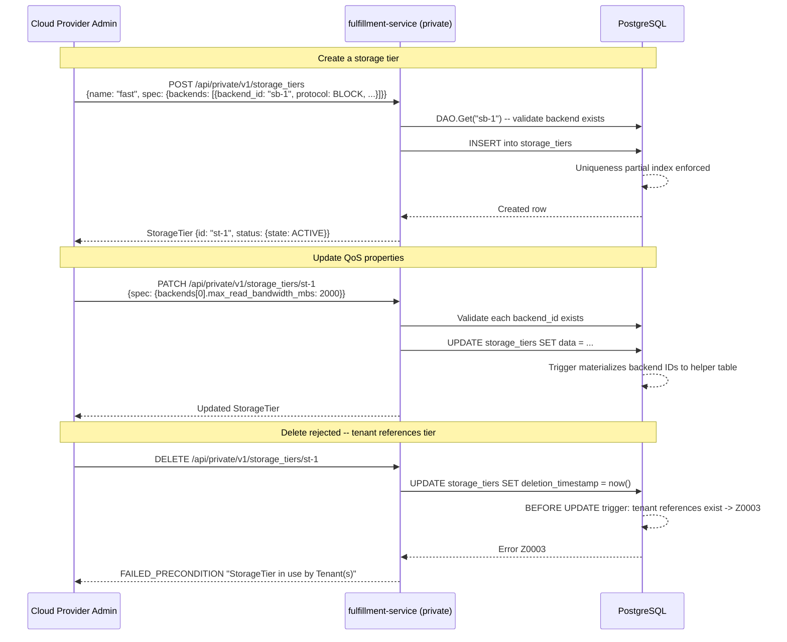
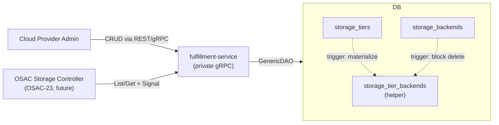

# StorageTier API

## Summary

This design introduces a `StorageTiers` gRPC service under `osac.private.v1` that enables Cloud Provider Admins to define named storage offerings with per-backend QoS properties (bandwidth, quota, encryption), stored in PostgreSQL with referential integrity against StorageBackend (OSAC-1111). The entity is DB-backed with no CRD or controller, following the StorageBackend pattern. See [PRD](prd.md) for detailed requirements.

## Motivation

OSAC configures storage tiers through the `STORAGE_TIERS` environment variable and Kubernetes label conventions (`osac.openshift.io/storage-tier`). The osac-operator discovers tiers by filtering StorageClasses with this label, so basic tier discovery works. The gaps are: (1) no structured QoS metadata (bandwidth limits, encryption, quota), (2) no referential integrity with registered storage backends, and (3) no API-managed catalog that exists before any StorageClasses are created.

StorageBackend (OSAC-1111) registers storage infrastructure -- endpoints, credentials, provider type. StorageTier fills the missing layer: a named offering that binds to registered backends with provider-neutral QoS properties. The OSAC Storage Controller (OSAC-23) consumes tier definitions to determine which StorageClasses to create and what QoS policies to apply during Tenant Storage Onboarding.

The design follows established fulfillment-service patterns: private gRPC service with REST transcoding, PostgreSQL storage via GenericDAO, referential integrity via DB triggers, and CEL-based filtering on List [Codebase: `fulfillment-service/internal/database/dao/`].

### Goals

- Reuse the existing GenericServer, GenericDAO, and migration patterns to minimize implementation risk [Codebase: `fulfillment-service/internal/servers/generic_server.go`].
- Store QoS properties as typed proto fields for schema evolution and compile-time safety.
- Enforce referential integrity between StorageTier and StorageBackend at the database level using triggers, matching the VirtualNetwork/Subnet pattern [Codebase: `fulfillment-service/internal/database/migrations/55_add_virtual_network_child_ref_triggers.up.sql`].
- Follow the standard OSAC object shape (`id`, `Metadata`, `StorageTierSpec`, `StorageTierStatus`) with spec/status split [Codebase: `fulfillment-service/proto/private/osac/private/v1/storage_backend_type.proto`].

### Non-Goals

- Public API for tenants -- tenants discover assigned tiers through the Tenant CR status, not by querying StorageTier directly.
- Kubernetes CRD or operator controller -- StorageTier is a DB-backed entity only, consistent with StorageBackend.
- Automatic StorageClass creation or refresh when QoS properties change -- that is the OSAC Storage Controller's responsibility (OSAC-23).
- Multi-backend selection logic -- v0.1 validates exactly one backend per tier; selection logic is deferred to OSAC-23.

## Proposal

StorageTier is a new private API resource in the fulfillment-service. It consists of two proto files (`storage_tier_type.proto`, `storage_tiers_service.proto`), a private server implementation, database migrations for the `storage_tiers` table with referential integrity triggers, and registration in the gRPC server startup and event system.

A StorageTier binds a named offering to a StorageBackend with protocol and QoS properties. The tier name (`metadata.name`) is immutable after creation. QoS properties in `spec.backends` are mutable to allow in-place updates that propagate to storage provider policies (e.g., VAST QoS policies). Referential integrity ensures backends cannot be deleted while tiers reference them.

### Workflow Description

**Actors:** Cloud Provider Admin (manages tiers via private API).

**Preconditions:** At least one StorageBackend (OSAC-1111) is registered and active.



The diagram shows three primary workflows: creation with backend validation, QoS update with backend re-validation, and deletion blocked by referential integrity.

**Error paths:**

- *Backend not found on Create/Update:* Server validates each `backend_id` via `DAO.Get` before persisting. Returns `NOT_FOUND` with the invalid backend ID.
- *Duplicate name on Create:* Partial unique index raises a constraint violation. The DAO translates it to `ALREADY_EXISTS`.
- *Concurrent update conflict:* When `lock = true`, the DAO's optimistic concurrency check rejects stale versions with `ABORTED`.
- *Tier in use on Delete:* `BEFORE UPDATE` trigger on `storage_tiers` checks for active Tenants referencing the tier. Returns `FAILED_PRECONDITION` (Z0003).

### API Extensions

**New gRPC service:** `osac.private.v1.StorageTiers` -- CRUD plus Signal. No public service, no CRDs, no webhooks, no finalizers.

**Event payload:** `StorageTier storage_tier = 39` in the `Event.oneof payload` message [Codebase: `fulfillment-service/proto/private/osac/private/v1/event_type.proto`].

**Impact if service is unavailable:** Cloud Provider Admins cannot manage tier definitions. Existing tiers persisted in the database remain readable. No impact on running tenant workloads.

### Implementation Details/Notes/Constraints

#### Proto Schema

**`storage_tier_type.proto`** defines the StorageTier message following the standard OSAC object shape with spec/status split, consistent with StorageBackend [Codebase: `storage_backend_type.proto`]:

```protobuf
syntax = "proto3";
package osac.private.v1;

import "osac/private/v1/metadata_type.proto";

enum StorageProtocol {
  STORAGE_PROTOCOL_UNSPECIFIED = 0;
  STORAGE_PROTOCOL_NFS = 1;
  STORAGE_PROTOCOL_BLOCK = 2;
}

enum StorageTierState {
  STORAGE_TIER_STATE_UNSPECIFIED = 0;
  STORAGE_TIER_STATE_ACTIVE = 1;
}

message BackendAssociation {
  string backend_id = 1;       // ID of the registered StorageBackend.
  StorageProtocol protocol = 2;
  int32 max_read_bandwidth_mbs = 3;   // MB/s
  int32 max_write_bandwidth_mbs = 4;  // MB/s
  int64 quota_gib = 5;                // GiB, int64 for petabyte-scale headroom
  bool encryption_enabled = 6;
}

message StorageTier {
  string id = 1;
  Metadata metadata = 2;       // metadata.name = tier name (immutable after create)
  StorageTierSpec spec = 3;    // Desired configuration (admin-modifiable)
  StorageTierStatus status = 4; // Observed state (system-controlled)
}

message StorageTierSpec {
  string description = 1;
  repeated BackendAssociation backends = 2; // v0.1: exactly one backend
}

message StorageTierStatus {
  StorageTierState state = 1;
  optional string message = 2;
}
```

Design notes:
- `metadata.name` carries the tier name (e.g., "fast", "standard"). Immutability is enforced in the server's Update method.
- `quota_gib` uses `int64` for petabyte-scale headroom, consistent with `compute_instance_type.proto` `Disk.size_gib`.
- `backends` is `repeated` to support future multi-backend tiers, but v0.1 validates exactly one backend.
- `StorageTierState` uses `ACTIVE` rather than `READY` because tiers are catalog offerings, not infrastructure endpoints. Additional states (`DEPRECATED`) are deferred.

**`storage_tiers_service.proto`** follows the StorageBackend service pattern [Codebase: `storage_backends_service.proto`]:

```protobuf
service StorageTiers {
  rpc List(StorageTiersListRequest) returns (StorageTiersListResponse) {
    option (google.api.http) = {get: "/api/private/v1/storage_tiers"};
  }
  rpc Get(StorageTiersGetRequest) returns (StorageTiersGetResponse) {
    option (google.api.http) = {
      get: "/api/private/v1/storage_tiers/{id}"
      response_body: "object"
    };
  }
  rpc Create(StorageTiersCreateRequest) returns (StorageTiersCreateResponse) {
    option (google.api.http) = {
      post: "/api/private/v1/storage_tiers"
      body: "object"
      response_body: "object"
    };
  }
  rpc Update(StorageTiersUpdateRequest) returns (StorageTiersUpdateResponse) {
    option (google.api.http) = {
      patch: "/api/private/v1/storage_tiers/{object.id}"
      body: "object"
      response_body: "object"
    };
  }
  rpc Delete(StorageTiersDeleteRequest) returns (StorageTiersDeleteResponse) {
    option (google.api.http) = {delete: "/api/private/v1/storage_tiers/{id}"};
  }
  rpc Signal(StorageTiersSignalRequest) returns (StorageTiersSignalResponse) {}
}
```

Request and response messages follow the established patterns: `offset`/`limit`/`filter`/`order` for List; `FieldMask` and `lock` for Update.

#### Server Implementation

`private_storage_tiers_server.go` follows the private server pattern [Codebase: `private_storage_backends_server.go`]:

- Builder pattern: `PrivateStorageTiersServerBuilder` with `SetLogger`, `SetNotifier`, `SetAttributionLogic`, `SetTenancyLogic`, `SetMetricsRegisterer`.
- Embeds `GenericServer[*privatev1.StorageTier]` for standard CRUD delegation.
- Custom validation in `Create` and `Update`:
  1. Validate exactly one backend in `spec.backends` (v0.1 constraint).
  2. For each `backend_id`, call `storageBackendsDAO.Get(ctx, backendID)` to verify the backend exists and is active. Return `NOT_FOUND` if missing.
  3. On `Create`: set `status.state = STORAGE_TIER_STATE_ACTIVE`.
  4. On `Update`: reject changes to `metadata.name` (immutable field).

**Event registration:** The GenericServer discovers the `storage_tier` payload field via protobuf reflection on the `Event.oneof payload`. No switch statement modification is needed -- the server constructor resolves the field descriptor by name at startup [Codebase: `generic_server.go:977`].

**gRPC registration:** In `start_grpc_server_cmd.go`, construct `PrivateStorageTiersServer` via the builder and register with `privatev1.RegisterStorageTiersServer(grpcServer, server)`.

#### Database Migration

Three migrations are required. The StorageBackend table migration (62) must be applied first.

**Migration 75: `create_storage_tiers_tables.up.sql`**

```sql
create table storage_tiers (
  id text not null primary key,
  name text not null default '',
  creation_timestamp timestamp with time zone not null default now(),
  deletion_timestamp timestamp with time zone not null default 'epoch',
  finalizers text[] not null default '{}',
  creator text not null default '',
  tenant text not null default '',
  labels jsonb not null default '{}'::jsonb,
  annotations jsonb not null default '{}'::jsonb,
  data jsonb not null
);

create table archived_storage_tiers (
  id text not null,
  name text not null default '',
  creation_timestamp timestamp with time zone not null,
  deletion_timestamp timestamp with time zone not null,
  archival_timestamp timestamp with time zone not null default now(),
  creator text not null default '',
  tenant text not null default '',
  labels jsonb not null default '{}'::jsonb,
  annotations jsonb not null default '{}'::jsonb,
  data jsonb not null
);

create index storage_tiers_by_name on storage_tiers (name);
create index storage_tiers_by_owner on storage_tiers (creator);
create index storage_tiers_by_tenant on storage_tiers (tenant);
create index storage_tiers_by_label on storage_tiers using gin (labels);

-- Platform-scoped name uniqueness among active (non-deleted) tiers:
create unique index storage_tiers_unique_name
  on storage_tiers (name)
  where deletion_timestamp = 'epoch' and name != '';
```

**Migration 76: `add_storage_tier_ref_triggers.up.sql`**

Creates the materialized helper table and referential integrity triggers:

```sql
-- Helper table: extracts backend IDs from JSONB for trigger-based reverse lookup.
create table storage_tier_backends (
  storage_tier_id text not null references storage_tiers(id) on delete cascade,
  backend_id text not null,
  primary key (storage_tier_id, backend_id)
);

create index storage_tier_backends_by_backend on storage_tier_backends (backend_id);

-- Materialize backend IDs from JSONB on insert/update:
create function materialize_storage_tier_backends() returns trigger as $$
declare
  bid text;
begin
  delete from storage_tier_backends where storage_tier_id = new.id;
  for bid in
    select jsonb_array_elements(new.data->'spec'->'backends')->>'backendId'
  loop
    insert into storage_tier_backends (storage_tier_id, backend_id)
    values (new.id, bid);
  end loop;
  return new;
end;
$$ language plpgsql;

create trigger materialize_storage_tier_backends
  after insert or update on storage_tiers
  for each row
  when (new.deletion_timestamp = 'epoch')
  execute function materialize_storage_tier_backends();

-- Validate backend references exist and are active (FOR SHARE prevents TOCTOU races):
create function check_storage_tier_backend_refs() returns trigger as $$
declare
  bid text;
  found_id text;
begin
  for bid in
    select jsonb_array_elements(new.data->'spec'->'backends')->>'backendId'
  loop
    select id into found_id
    from storage_backends
    where id = bid and deletion_timestamp = 'epoch'
    for share;
    if found_id is null then
      raise exception using
        errcode = 'Z0002',
        message = format('StorageBackend ''%s'' does not exist or has been deleted', bid);
    end if;
  end loop;
  return new;
end;
$$ language plpgsql;

create trigger check_storage_tier_backend_refs
  before insert or update on storage_tiers
  for each row
  when (new.deletion_timestamp = 'epoch')
  execute function check_storage_tier_backend_refs();

-- Prevent deleting a StorageBackend referenced by active tiers:
create function check_storage_backend_not_in_use_by_tier() returns trigger as $$
declare
  tier_count bigint;
begin
  select count(*) into tier_count
  from storage_tier_backends stb
  join storage_tiers st on st.id = stb.storage_tier_id
  where stb.backend_id = old.id and st.deletion_timestamp = 'epoch';
  if tier_count > 0 then
    raise exception using
      errcode = 'Z0003',
      message = format('cannot delete StorageBackend ''%s'': %s StorageTier(s) reference it', old.id, tier_count);
  end if;
  return new;
end;
$$ language plpgsql;

create trigger check_storage_backend_not_in_use_by_tier
  before update on storage_backends
  for each row
  when (old.deletion_timestamp = 'epoch' and new.deletion_timestamp != 'epoch')
  execute function check_storage_backend_not_in_use_by_tier();

-- Backfill (table expected to be empty at migration time):
update storage_tiers set data = data;
```

The JSONB path `new.data->'spec'->'backends'` reflects the spec/status proto structure serialized to JSONB.

**Migration 77: `restructure_storage_tier_spec_status.up.sql`** restructures existing data if any rows were created before the spec/status split was adopted (OSAC-2396). This migration is a no-op for fresh deployments.

**Tenant-reference trigger:** The trigger preventing StorageTier deletion when tenants reference it is deferred to a follow-up migration shipping with OSAC-23. No tenants can reference tiers until OSAC-23 lands, so no protection gap exists. [Assumption]

Design notes on triggers:
- The `storage_tier_backends` helper table enables efficient reverse lookup from backend ID to tiers, avoiding full-table JSONB scans on `storage_tiers`.
- The materialization trigger fires only for active tiers (`WHEN (new.deletion_timestamp = 'epoch')`). On soft-delete, stale helper rows persist until archival hard-deletes the row (cleaned up via `ON DELETE CASCADE`).
- The backend validation trigger uses `FOR SHARE` locking to prevent TOCTOU races with concurrent backend deletion.
- The `storage_tier_backends` table is excluded from schema validation in `database_tool.go` (helper table pattern).

#### Component Interaction



The fulfillment-service is the sole writer to `storage_tiers`. The OSAC Storage Controller (future) reads tier definitions via gRPC. Referential integrity is enforced at the database layer through triggers, with `storage_tier_backends` serving as the materialized lookup table.

## UX Alignment

The `@temp-api` file at `osac-ux/libs/ui-components/src/api/v1/storage-tier.ts` defines the UI's StorageTier interface. The mapping below documents deviations between the UI and proto designs.

| UI field (`@temp-api` TypeScript) | Proto field (this design) | Notes / deviation |
|---|---|---|
| `metadata.name` | `metadata.name` | Direct mapping |
| `metadata.description` | `spec.description` | Deviation: proto places description in spec (admin-modifiable desired state) |
| `metadata.labels` | `metadata.labels` | Direct mapping |
| `spec.displayName` | `metadata.name` | Deviation: proto uses `metadata.name` as the canonical display name |
| `spec.protocol` | `spec.backends[].protocol` | Deviation: proto scopes protocol per backend association, not per tier |
| `spec.qosClass` | N/A | Deviation: no single QoS class field; QoS is expressed as typed fields per backend association |
| `spec.storageClassName` | N/A | Omitted: Kubernetes-internal field, not exposed in the StorageTier API (known deviation) |
| `spec.storageBackend` | `spec.backends[].backend_id` | Deviation: proto uses repeated BackendAssociation list instead of single string reference |
| `status.available` | `status.state == STORAGE_TIER_STATE_ACTIVE` | Mapping: boolean maps to state enum check |

Key deviations from known anti-patterns:
- **`spec.storageClassName`**: Kubernetes StorageClass name is an infrastructure detail managed by the OSAC Storage Controller (OSAC-23), not exposed in the StorageTier public-facing API.
- **`spec.qosClass`**: The UI's string-based `qosClass` is replaced by typed per-backend QoS fields (bandwidth, quota, encryption) for schema safety and provider-neutral representation.

After `pnpm gen-types` runs against the shipped proto, the UI migration diff should be limited to the deviations above.

### Security Considerations

StorageTier inherits the fulfillment-service's existing security model:

- **Authentication:** JWT validation via the gRPC interceptor chain. Only authenticated Cloud Provider Admin tokens can access the private API.
- **Authorization:** OPA policies enforce admin-only access. No new OPA rules required.
- **Input validation:** Backend IDs validated via `DAO.Get` (existence check). QoS numeric fields are typed proto fields with natural bounds (int32/int64). `StorageProtocol` is a proto enum -- invalid values rejected by proto unmarshaling.
- **Data exposure:** No sensitive data in StorageTier. QoS properties are operational metadata. StorageBackend credentials remain in the StorageBackend entity.

### Failure Handling and Recovery

| Failure Mode | Behavior | User Observation |
|---|---|---|
| Backend validation fails on Create | Server returns `NOT_FOUND` with the invalid backend ID. No row inserted. | Admin corrects the backend ID and retries. |
| Name uniqueness violation | Partial unique index raises constraint violation. DAO translates to `ALREADY_EXISTS`. | Admin chooses a different name or deletes the existing tier first. |
| Optimistic lock conflict on Update | DAO compares `metadata.version`; mismatch returns `ABORTED`. | Admin re-fetches the tier, reapplies changes, retries. |
| StorageBackend deletion blocked | Trigger raises Z0003. DAO translates to `FAILED_PRECONDITION`. | Admin removes backend association from referencing tiers first. |
| StorageTier deletion blocked by tenant | Trigger raises Z0003. DAO translates to `FAILED_PRECONDITION`. | Admin unassigns the tier from tenants first. (Trigger deferred to OSAC-23.) |
| PostgreSQL unavailable | Standard DAO error propagation; gRPC returns `UNAVAILABLE`. | Admin retries. No data corruption -- transaction never committed. |
| Materialization trigger failure | Transaction rolls back. No partial state in helper table. | Admin retries the Create/Update. |

All operations are transactional. No async reconciliation, so controller restart mid-reconciliation is not applicable.

### RBAC / Tenancy

StorageTier is platform-scoped, managed exclusively by Cloud Provider Admins, following the same tenancy model as NetworkClass and StorageBackend:

- The `tenant` column is populated by the existing `tenancyLogic` (assigns platform-scoped entities to the system tenant).
- Tenant isolation annotations (`osac.openshift.io/tenant`) are set by the standard attribution logic. The `osac.openshift.io/owner-reference` annotation is not applicable -- StorageTier is a top-level platform-scoped entity with no parent resource in the OSAC resource hierarchy.
- No new OPA policies required. The private API's existing admin-only access control is sufficient.
- Tenants do not access StorageTier directly -- they discover assigned tiers through the Tenant resource's status (populated by OSAC-23).

### Observability and Monitoring

No new observability changes. Existing monitoring mechanisms apply:

- gRPC interceptor chain emits Prometheus metrics for all RPCs (request count, latency, error rate) -- automatically covers StorageTier RPCs.
- Structured logging via slog captures CRUD operations with resource IDs.
- The notification system (event payloads via `setPayload()`) enables downstream consumers to react to StorageTier changes.

### Risks and Mitigations

**Migration ordering with OSAC-1111:** The referential integrity triggers migration (76) creates a trigger on the `storage_backends` table. If StorageBackend migrations (62) are not applied first, migration 76 fails. Mitigation: migrations are numbered sequentially and applied in order; OSAC-1111 is a stated dependency.

**Tenant reference trigger deferred:** The trigger preventing StorageTier deletion when tenants reference it ships with OSAC-23. No protection gap -- no tenants can reference tiers until OSAC-23 lands. [Assumption]

**QoS update propagation limits:** Changes to QoS properties that map to Kubernetes StorageClass parameters (e.g., encryption settings) require StorageClass recreation for new volumes. Existing volumes are unaffected. Mitigation: the OSAC Storage Controller (OSAC-23) handles StorageClass lifecycle including parameter drift detection.

### Drawbacks

Adding another DB-backed entity with referential integrity triggers increases migration complexity and requires coordinating two features (OSAC-1110 and OSAC-1111). However, the alternative -- free-form JSON for QoS or no referential integrity -- creates worse problems: schema drift, no compile-time safety, and orphaned references.

The materialized helper table (`storage_tier_backends`) adds a maintenance surface: the materialization trigger must be updated if the JSONB schema for `spec.backends` changes. This cost is justified by efficient reverse lookups when blocking StorageBackend deletion -- a full-table JSONB scan on `storage_tiers` would not scale.

## Alternatives (Not Implemented)

**Free-form JSON for QoS properties:** Store QoS as `google.protobuf.Struct` or `map<string, string>`. Pros: maximum flexibility, no proto changes when adding properties. Cons: no compile-time type safety, no field-level validation, CEL filtering on nested fields requires custom translator support. Rejected: typed fields provide better developer experience and catch errors at compile time.

**Server-side-only referential integrity (no DB triggers):** Validate backend references in Go server code without triggers. Pros: simpler migrations. Cons: does not protect against concurrent races (simultaneous StorageBackend delete and StorageTier create). Rejected: the trigger approach matches the VirtualNetwork/Subnet pattern and provides stronger TOCTOU guarantees.

**CRD-backed StorageTier with a controller:** Define StorageTier as a Kubernetes CRD with a reconciler. Pros: native Kubernetes semantics. Cons: unnecessary complexity for a catalog entity with no async provisioning lifecycle; requires syncing state between CRD and DB. Rejected: StorageTier is a static catalog entry, not a managed resource.

**Do nothing (keep `STORAGE_TIERS` env var):** Continue using environment variables. Pros: zero effort. Cons: tiers are not queryable via API, no referential integrity, no QoS metadata, no audit trail. Rejected: OSAC-23 requires an API-managed tier catalog.

## Test Plan

### Unit Tests

Unit tests (`ginkgo run -r internal`):
- `PrivateStorageTiersServer` CRUD lifecycle: create with valid backend, get by ID, list with pagination and filtering, update QoS properties, soft-delete.
- Backend validation: reject create/update with non-existent backend ID, returning `NOT_FOUND`.
- Single-backend constraint: reject create with zero backends or more than one backend (v0.1).
- Name immutability: reject update that changes `metadata.name`.
- Optimistic concurrency: reject update with stale `metadata.version`, returning `ABORTED`.
- Event payload: verify `StorageTier` event payload is populated on create/update/delete.

### Integration Tests

Integration tests (`ginkgo run it`):
- Full CRUD via gRPC and REST endpoints against a kind cluster with PostgreSQL.
- Referential integrity: create StorageTier referencing a StorageBackend, then attempt to delete the backend -- verify `FAILED_PRECONDITION` with Z0003.
- Name uniqueness: create two tiers with the same name -- verify `ALREADY_EXISTS`. Delete the first tier, recreate with the same name -- verify name reuse succeeds.
- Trigger behavior: verify `storage_tier_backends` helper table is populated correctly after create and update, and cleaned up via cascade on hard delete.
- CEL filtering: list tiers filtering by `status.state` and `spec.description`.

### E2E Tests

E2E tests (osac-test-infra, pytest):
- Cloud Provider Admin workflow: register a StorageBackend, create a StorageTier referencing it, verify the tier appears in List, update QoS properties, delete the tier.
- Error path: attempt to create a tier referencing a non-existent backend via REST, verify HTTP 404 response.

## Graduation Criteria

Graduation criteria will be defined when targeting a release. Expected stages: Dev Preview -> Tech Preview -> GA based on production deployment feedback.

## Upgrade / Downgrade Strategy

This is a new API with no upgrade impact. Database migrations add new tables and triggers without modifying existing tables.

Downgrade requires:
1. Deleting all StorageTier instances via the API.
2. Reverting migration 76 (drop triggers, drop `storage_tier_backends` helper table).
3. Reverting migration 75 (drop `storage_tiers` and `archived_storage_tiers` tables).

No other components depend on StorageTier at initial deployment. When OSAC-23 lands, downgrade must also remove tier references from Tenant resources.

## Version Skew Strategy

StorageTier is entirely within the fulfillment-service -- no cross-component version skew applies. The gRPC service and database migrations are deployed together as part of the fulfillment-service image. The OSAC Storage Controller (OSAC-23, future) consumes StorageTier via gRPC; standard proto backward compatibility (additive-only field changes) ensures version skew tolerance.

## Support Procedures

**Failure detection:**
- gRPC error rate increase on `osac.private.v1.StorageTiers/*` RPCs (visible in existing Prometheus dashboards).
- PostgreSQL migration failure logs during service startup.
- Trigger errors (Z0002, Z0003) logged at WARN level with resource ID and referencing entity count.

**Disabling the feature:**
- Remove `PrivateStorageTiersServer` registration from gRPC server startup. RPCs return `UNIMPLEMENTED`.
- Existing data in `storage_tiers` is inert -- no controllers read it without the OSAC Storage Controller.
- No impact on existing workloads.

**Recovery:**
- Re-register the server. Database tables and triggers remain intact. No data loss or consistency issues.

## Infrastructure Needed

None.
