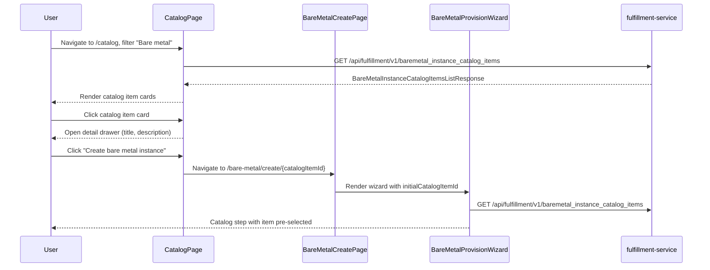

# BareMetal Instance UI

## Summary

This design implements the tenant-facing UI for discovering, provisioning, and managing bare metal instances using React 19, PatternFly 6, and TanStack Query. The implementation adds a catalog item browser within the existing Catalog page, a bare metal instance list page with inline lifecycle actions, a create wizard, and a detail page with power management and condition inspection. See [PRD](prd.md) for detailed requirements.

## Motivation

The fulfillment-service already exposes gRPC/REST endpoints for `BareMetalInstance` and `BareMetalInstanceCatalogItem` resources (defined in the [BareMetal Instance API EP](/enhancements/OSAC-1118-baremetal-instance-api)). However, without a web console, the only path to request and manage bare metal hardware is through the gRPC/REST API or CLI. This blocks adoption for tenants who rely on click-ops workflows -- the same audience that currently uses the console to order virtual machines and clusters.

The osac-ux codebase already contains foundational components for this feature: API hooks (`useBareMetalInstances`, `useBareMetalInstance`, `useCreateBareMetalInstance`, `usePatchBareMetalInstance`, `useDeleteBareMetalInstance`, `useBareMetalInstanceCatalogItems`), a list page (`BareMetalListPage`), a create page with a provisioning wizard (`BareMetalCreatePage` with `BareMetalProvisionWizard`), a detail page (`BareMetalDetailsPage`) with overview/power management/conditions/console tabs, and catalog integration in `CatalogPage`. The design formalizes these existing implementations, identifies gaps relative to the PRD, and specifies the remaining work.

### Goals

- Reuse and extend the existing osac-ux bare metal components rather than building from scratch [Codebase: `osac-ux/libs/ui-components/src/components/Baremetal/`]
- Follow established osac-ui patterns for query hooks, page layout, form validation, and wizard steps [Codebase: `osac-ux/libs/ui-components/src/api/v1/baremetal-instance.ts`]
- Provide lifecycle actions (power toggle, restart, delete) on both the list page and detail page to support quick management without navigation
- Handle resource lifecycle states (Provisioning, Running, Failed, Stopped, Deleting) with auto-refresh polling and appropriate status badges

### Non-Goals

- Cloud Provider Admin flows: creating, editing, or deleting `BareMetalInstanceTemplate` or `BareMetalInstanceCatalogItem` resources (provider-scoped, out of scope for tenant UI)
- Tenant Admin catalog item CRUD: creating, editing, or deleting tenant-scoped `BareMetalInstanceCatalogItem` resources
- OS image selection UI (the PRD lists OS image as optional, but the existing wizard does not include an OS image field; this is deferred to a future phase) [Assumption]
- Bare metal networking configuration (VirtualNetwork/Subnet attachment for bare metal instances)

## Proposal

This design formalizes the existing osac-ux bare metal UI components and specifies the gaps that need to be closed for PRD compliance. The implementation touches one repository: `osac-ux` (the UI). No backend changes are required -- the fulfillment API surface is already stable.

Three categories of work are required:

1. **Catalog integration** -- the existing `CatalogPage` already renders `BareMetalInstanceCatalogItem` entries with a "Create bare metal instance" action that navigates to `/bare-metal/create/{catalogItemId}`. The catalog item detail drawer shows title and description. Markdown rendering of the description field needs verification.

2. **List page enhancements** -- the existing `BareMetalListPage` supports search, status filtering, table rendering (Name, State, Catalog item, Run strategy, Created), row click navigation to detail, and delete via `ActionsColumn`. Gaps: power toggle and restart inline actions, auto-refresh for non-terminal states.

3. **Detail page and wizard** -- the existing `BareMetalDetailsPage` includes overview/power management/conditions/console tabs, power toggle and restart buttons, and a delete confirmation modal. The existing wizard (`BareMetalProvisionWizard`) includes catalog item selection, general configuration (name, run strategy), and SSH/user data configuration steps. Gaps: SSH key format validation, user data size guard, catalog-to-wizard pre-selection flow.

### Workflow Description

#### Workflow 1: Browse catalog items and provision from catalog

**Actor:** Tenant User

1. User navigates to the Catalog page (`/catalog`)
2. User filters by "Bare metal" type filter (existing `ToggleGroup` filter)
3. `BareMetalInstanceCatalogItem` entries render as cards in the catalog gallery showing title, description, and hardware profile from `fieldDefinitions`
4. User clicks a catalog item card; a detail drawer opens showing title and Markdown-rendered description
5. User clicks "Create bare metal instance" in the drawer
6. UI navigates to `/bare-metal/create/{catalogItemId}` with `{ from: '/catalog' }` location state
7. The `BareMetalProvisionWizard` opens with the catalog item pre-selected in the Catalog step
8. Breadcrumb shows "Catalog > Create bare metal" (context-aware based on `fromCatalog` flag)



#### Workflow 2: Provision a bare metal instance from list page

**Actor:** Tenant User

1. User navigates to Bare Metal list page (`/bare-metal`)
2. User clicks "Create bare metal" button
3. UI navigates to `/bare-metal/create`
4. Wizard opens at the Catalog step with no pre-selection
5. User selects a catalog item from the gallery (searchable), clicks Next
6. User enters instance name and selects run strategy (Always on / Halted), clicks Next
7. User optionally enters SSH public key (validated as OpenSSH format on blur) and user data (size guard: max 64 KB), clicks Next
8. Review step shows summary of all selections; user clicks "Create"
9. POST `/api/fulfillment/v1/baremetal_instances` with body `{ metadata: { name }, spec: { catalogItem, sshPublicKey, userData, runStrategy } }`
10. On success: wizard closes, user navigates to `/bare-metal` (list page)
11. New instance appears in list with "Provisioning" status badge

**Error handling:**
- Validation failure: inline error messages below invalid fields after blur or submit attempt; submit button remains enabled but validation errors are highlighted on click
- API error (4xx/5xx): error alert displayed on the Review step with API error message; wizard remains open with user input preserved
- SSH key validation failure: helper text turns red with message "Invalid SSH public key format. Expected OpenSSH format (ssh-rsa, ssh-ed25519, ecdsa-sha2-nistp256, etc.)"
- User data exceeds 64 KB: helper text turns red with message "User data exceeds maximum size of 64 KB"

#### Workflow 3: Manage instance lifecycle from list page

**Actor:** Tenant User

1. User views bare metal instance list at `/bare-metal`
2. For a running instance, user opens the `ActionsColumn` kebab menu
3. Available actions:
   - **Power off**: PATCH `/api/fulfillment/v1/baremetal_instances/{id}` with `{ spec: { runStrategy: HALTED } }`. Disabled while instance is Provisioning or Deleting.
   - **Restart**: PATCH `/api/fulfillment/v1/baremetal_instances/{id}` with `{ spec: { restartTrigger: currentTrigger + 1 } }`. Disabled unless instance state is Running.
   - **Delete**: opens `BareMetalDeleteConfirmModal`. Disabled while instance is Deleting.
4. For a stopped instance, the power action becomes **Power on**: PATCH with `{ spec: { runStrategy: ALWAYS } }`

#### Workflow 4: Inspect and manage instance from detail page

**Actor:** Tenant User

1. User clicks an instance name in the list or navigates to `/bare-metal/{id}`
2. Detail page loads with `ResourceDetailHeader` (breadcrumb, name, status badge) and `BareMetalDetailsSummary` (KPI row: status, catalog item, price, created)
3. Header action buttons: Power on/off, Restart, Delete
4. Tabs: Overview (ID, name, state, catalog item, SSH key presence, created, creator), Power management (run strategy label, restart trigger counter, restart conditions), Conditions (table of all conditions with type/status/message), Console
5. Power toggle: changes run strategy via PATCH; disabled while Provisioning or Deleting
6. Restart: increments `restartTrigger` via PATCH; disabled unless Running; shows restart condition alerts (in progress, failed, required) in Power management tab
7. Delete: opens confirmation modal; on success navigates to `/bare-metal`
8. Failed instance: status badge shows "Failed" (red); Conditions tab displays condition details explaining why provisioning failed

### API Extensions

This design does not introduce new API extensions. The fulfillment API already provides the required gRPC services and REST gateway endpoints:

- `BareMetalInstances` service: List, Get, Create, Patch, Delete
- `BareMetalInstanceCatalogItems` service: List, Get (read-only for tenants; CRUD for providers is out of scope)

The UI consumes these services via the REST gateway (`/api/fulfillment/v1/*`). No CRD changes, webhooks, or finalizers are required -- this is a pure frontend implementation.

### Implementation Details/Notes/Constraints

#### Existing Component Inventory

The following components already exist in osac-ux and require only targeted enhancements:

| Component | Path | Status |
|-----------|------|--------|
| `BareMetalListPage` | `pages/tenant/BareMetalListPage.tsx` | Exists; needs inline power/restart actions, auto-refresh |
| `BareMetalCreatePage` | `pages/tenant/BareMetalCreatePage.tsx` | Exists; functional with catalog pre-selection |
| `BareMetalDetailsPage` | `components/Baremetal/BareMetalDetailsPage.tsx` | Exists; has overview/power/conditions/console tabs |
| `BareMetalDeleteConfirmModal` | `components/Baremetal/BareMetalDeleteConfirmModal.tsx` | Exists; functional |
| `BareMetalStatusLabel` | `components/Baremetal/BareMetalStatusLabel.tsx` | Exists; maps all states including Starting/Stopping/Stopped |
| `BareMetalDetailsSummary` | `components/Baremetal/BareMetalDetailsSummary.tsx` | Exists; KPI header with status/catalog/price/created |
| `BareMetalProvisionWizard` | `components/catalogProvision/BareMetalProvisionWizard.tsx` | Exists; 4-step wizard |
| `BareMetalCatalogStep` | `wizard/baremetal/BareMetalCatalogStep.tsx` | Exists; gallery with search |
| `BareMetalGeneralStep` | `wizard/baremetal/BareMetalGeneralStep.tsx` | Exists; name + run strategy |
| `BareMetalConfigurationStep` | `wizard/baremetal/BareMetalConfigurationStep.tsx` | Exists; SSH key + user data |
| `BareMetalReviewStep` | `wizard/baremetal/BareMetalReviewStep.tsx` | Exists; summary with error display |
| API hooks | `api/v1/baremetal-instance.ts` | Exists; all CRUD hooks present |
| Catalog integration | `pages/tenant/CatalogPage.tsx` | Exists; bare metal filter and drawer action |
| Navigation | `shell/shellNav.ts` | Exists; "Bare Metal" sidebar entry |
| Routes | `shell/AppShell.tsx` | Exists; `/bare-metal`, `/bare-metal/create/:catalogItemId?`, `/bare-metal/:id` |

#### Gap Analysis and Required Changes

**Gap 1: List page inline lifecycle actions** [PRD: Instance management user stories]

The existing `BareMetalListPage` `ActionsColumn` only includes Delete. Add Power on/off and Restart actions:

```typescript
// In BareMetalListPage.tsx, within ActionsColumn items array:
const getRowActions = (instance: BareMetalInstance) => {
  const state = instance.status?.state;
  const isTransitioning = state === BareMetalInstanceState.PROVISIONING
    || state === BareMetalInstanceState.DELETING
    || state === BareMetalInstanceState.STARTING
    || state === BareMetalInstanceState.STOPPING;
  const isRunning = state === BareMetalInstanceState.RUNNING;
  const isStopped = state === BareMetalInstanceState.STOPPED;

  return [
    {
      title: isStopped ? 'Power on' : 'Power off',
      onClick: () => patchInstance({
        id: instance.id,
        patch: {
          spec: {
            runStrategy: isStopped
              ? BareMetalInstanceRunStrategy.ALWAYS
              : BareMetalInstanceRunStrategy.HALTED,
          },
        },
      }),
      isDisabled: isTransitioning,
    },
    {
      title: 'Restart',
      onClick: () => patchInstance({
        id: instance.id,
        patch: {
          spec: {
            restartTrigger: (instance.spec?.restartTrigger ?? BigInt(0)) + BigInt(1),
          },
        },
      }),
      isDisabled: !isRunning,
    },
    { isSeparator: true },
    {
      title: 'Delete',
      onClick: () => setInstanceToDelete(instance),
      isDisabled: state === BareMetalInstanceState.DELETING,
    },
  ];
};
```

**Gap 2: Auto-refresh for non-terminal states** [PRD: Lifecycle monitoring user stories]

Add `refetchInterval` to `useBareMetalInstances` in the list page to poll while any instance is in a non-terminal state:

```typescript
const { data: instances = [], isLoading, error } = useBareMetalInstances();
// Enhance useBareMetalInstances call with refetchInterval:
const hasNonTerminal = instances.some((i) => {
  const s = i.status?.state;
  return s === BareMetalInstanceState.PROVISIONING
    || s === BareMetalInstanceState.DELETING
    || s === BareMetalInstanceState.STARTING
    || s === BareMetalInstanceState.STOPPING;
});
// Pass refetchInterval option: 5000ms when non-terminal states exist, false otherwise
```

The detail page (`BareMetalDetailsPage`) similarly adds `refetchInterval` to its `useBareMetalInstance(id)` query.

**Gap 3: SSH key format validation** [PRD: Provisioning user stories]

Add client-side validation to `BareMetalConfigurationStep` for SSH public key format:

```typescript
const SSH_KEY_REGEX = /^(ssh-(rsa|ed25519|dss)|ecdsa-sha2-nistp(256|384|521))\s+\S+/;

const validateSshKey = (value: string): string | undefined => {
  if (!value.trim()) return undefined; // optional field
  if (!SSH_KEY_REGEX.test(value.trim())) {
    return 'Invalid SSH public key format. Expected OpenSSH format (ssh-rsa, ssh-ed25519, etc.)';
  }
  return undefined;
};
```

**Gap 4: User data size guard** [PRD: Provisioning user stories]

Add client-side validation for max 64 KB user data:

```typescript
const MAX_USER_DATA_BYTES = 64 * 1024; // 64 KB

const validateUserData = (value: string): string | undefined => {
  if (!value) return undefined;
  const byteLength = new TextEncoder().encode(value).length;
  if (byteLength > MAX_USER_DATA_BYTES) {
    return `User data exceeds maximum size of 64 KB (current: ${Math.ceil(byteLength / 1024)} KB)`;
  }
  return undefined;
};
```

**Gap 5: Catalog description Markdown rendering** [PRD: Catalog browsing user stories]

Verify that `CatalogItemCard` and the catalog detail drawer render the `description` field as Markdown. If plain text only, add a Markdown renderer (e.g., `react-markdown` or PatternFly `Content` with HTML) to the catalog item detail drawer for bare metal catalog items.

#### Data Models

The UI consumes protobuf-generated TypeScript types from `@osac/types`. Key interfaces used by existing components:

```typescript
interface BareMetalInstance {
  id: string;
  metadata?: {
    name?: string;
    labels?: Record<string, string>;
    annotations?: Record<string, string>;
    creationTimestamp?: string;
    creator?: string;
  };
  spec?: {
    catalogItem?: string;         // BareMetalInstanceCatalogItem ID
    sshPublicKey?: string;        // OpenSSH format
    userData?: string;            // cloud-init, max 64 KB
    runStrategy?: BareMetalInstanceRunStrategy;  // ALWAYS=1, HALTED=2
    restartTrigger?: bigint;      // incremented to trigger restart
  };
  status?: {
    state?: BareMetalInstanceState;  // PROVISIONING, RUNNING, FAILED, DELETING, STARTING, STOPPING, STOPPED
    message?: string;
    conditions?: Condition[];
    restartTrigger?: bigint;     // acknowledged value
  };
}

interface BareMetalInstanceCatalogItem {
  id: string;
  title?: string;
  description?: string;          // Markdown-rendered in UI
  template?: string;             // BareMetalInstanceTemplate reference
  published?: boolean;
  metadata?: { labels?: Record<string, string>; };
  fieldDefinitions?: FieldDefinition[];
}
```

#### Status Handling

The existing `BareMetalStatusLabel` component maps all states:

| State | Color | Text | Spinner |
|-------|-------|------|---------|
| PROVISIONING | blue | Provisioning | Yes |
| RUNNING | green | Running | No |
| FAILED | red | Failed | No |
| DELETING | red | Deleting | Yes |
| STARTING | blue | Starting | Yes |
| STOPPING | orange | Stopping | Yes |
| STOPPED | orange | Stopped | No |
| UNSPECIFIED | grey | Unknown | No |

Transition states (PROVISIONING, STARTING, STOPPING, DELETING) show a spinner icon via the `TRANSITION_STATES` set. [Codebase: `BareMetalStatusLabel.tsx`]

#### Form Validation

All validation is client-side with server-side validation as the authoritative check:

| Field | Rule | Error message |
|-------|------|---------------|
| Instance name | Required, non-empty after trim | "Instance name is required." |
| Catalog item | Required selection | Wizard step cannot advance without selection (`isBmStepValid`) |
| SSH public key | Optional; if provided, must match OpenSSH format regex | "Invalid SSH public key format..." |
| User data | Optional; max 64 KB (measured in bytes via `TextEncoder`) | "User data exceeds maximum size of 64 KB" |
| Run strategy | Required, defaults to ALWAYS | Always valid (toggle group with default) |

### UX Alignment

The `@temp-api` files exist at `osac-ux/libs/ui-components/src/api/v1/baremetal-instance.ts`. Field mapping:

| UI field (`@temp-api` TypeScript) | Proto field (fulfillment-service) | Notes |
|---|---|---|
| `spec.catalogItem` | `spec.catalog_item` | Direct mapping (camelCase to snake_case) |
| `spec.sshPublicKey` | `spec.ssh_public_key` | Direct mapping |
| `spec.userData` | `spec.user_data` | Direct mapping |
| `spec.runStrategy` | `spec.run_strategy` | Numeric enum: ALWAYS=1, HALTED=2 |
| `spec.restartTrigger` | `spec.restart_trigger` | BigInt; incremented for restart |
| `status.state` | `status.state` | Numeric enum mapped via `BareMetalInstanceState` |
| `status.restartTrigger` | `status.restart_trigger` | Acknowledged restart trigger value |
| `metadata.name` | `metadata.name` | Direct mapping |
| `metadata.creationTimestamp` | `metadata.creation_timestamp` | Direct mapping |

No deviations from known anti-patterns. The existing hooks use `useMutation` with proper `apiFetch` calls and do not use sub-resource action patterns.

### Security Considerations

The design inherits the existing osac-ui security model without changes:

- **Authentication:** Handled by the Go proxy (`proxy/`). The proxy validates OIDC tokens and forwards authenticated requests to fulfillment-service with tenant context in headers.
- **Authorization:** Enforced by fulfillment-service. Tenant-scoped resources include `osac.openshift.io/tenant` annotation injected server-side. OPA policies enforce tenant isolation.
- **Input validation:** Client-side validation (SSH key format, user data size) prevents common errors but does not replace server-side validation. The fulfillment API validates all inputs and returns appropriate error responses.
- **Data exposure:** SSH public keys are displayed as masked ("......") on the detail page overview tab, not as full text. User data is shown as "Provided" / "Not set" labels, not as raw content. No sensitive data is exposed.

No new security mechanisms are required for this UI-only enhancement.

### Failure Handling and Recovery

#### Client-Side Failures

**Network errors (fetch failures):**
- TanStack Query retries failed GET requests up to 3 times with exponential backoff (default behavior).
- If all retries fail, list page shows error state via `ListPageBody` error prop. Detail page shows `ResourceDetailsPageError` with `variant="load-error"`.
- Mutation errors (POST/PATCH/DELETE) are not retried automatically. Wizard shows error alert on the Review step. Detail page shows error alert in the Power management tab.

**Validation errors:**
- Client-side validation shows inline error messages via `FormHelperText` with `HelperTextItem variant="error"` after blur or failed submit attempt.
- Server-side validation errors (e.g., duplicate name) are shown as error alerts with the API-provided error message.

#### API-Side Failures

**Provisioning failures:**
- Instance transitions to FAILED state with `status.message` containing the error reason.
- Detail page shows "Failed" status badge (red) in header. Conditions tab displays condition details.
- No automatic retry from the UI. User can delete the failed instance and create a new one.

**PATCH failures (power toggle, restart):**
- Detail page shows `patchError` in an inline danger Alert in the Power management tab: "Operation failed" with error message. [Codebase: `BareMetalDetailsPage.tsx` line 398-404]
- Button loading state clears. User can retry.

**DELETE failures:**
- `BareMetalDeleteConfirmModal` shows inline danger Alert: "Failed to delete instance" with error message. [Codebase: `BareMetalDeleteConfirmModal.tsx` line 66-70]
- Modal remains open. User can retry or cancel.

#### Idempotency

- CREATE (POST) is not idempotent; the wizard disables the submit button after first click via `isPending` state to prevent double-submission.
- PATCH is idempotent (setting run strategy to the same value is a no-op). Safe to retry.
- DELETE is idempotent (deleting an already-deleted resource returns 404, handled gracefully). Safe to retry.

### RBAC / Tenancy

No RBAC or tenancy changes required. The design leverages existing mechanisms:

- **Tenant isolation:** All `BareMetalInstance` resources include `osac.openshift.io/tenant` annotation injected by fulfillment-service on POST based on the authenticated user's tenant context. The fulfillment API filters List responses by tenant. The UI does not implement additional filtering.
- **Role-based access:** The list page conditionally shows the "Create bare metal" button based on session role (`role === 'tenantUser'`). Both Tenant Users and Tenant Admins can view and manage instances.
- **Catalog visibility:** `useBareMetalInstanceCatalogItems` filters catalog items by `published` status and tenant allowlist via `catalogItemIsAllowed`. [Codebase: `baremetal-instance.ts` line 79]

### Observability and Monitoring

No new observability changes. Existing monitoring mechanisms apply:

- fulfillment-service emits Prometheus metrics for API request rates and latencies by endpoint.
- The Go proxy logs all HTTP requests (method, path, status code, duration).
- No new client-side telemetry or metrics are introduced.

### Risks and Mitigations

**Risk 1: Restart trigger BigInt handling**

The `restartTrigger` field uses `bigint` in TypeScript (mapped from protobuf `int64`). Some JSON serialization paths may convert BigInt to number, losing precision for values > `Number.MAX_SAFE_INTEGER`.

- **Mitigation:** The existing implementation already uses `BigInt()` arithmetic for increment. The `BareMetalInstanceSchema` decoder handles protobuf int64 to BigInt conversion. Risk is low for normal usage where restart counts remain small.

**Risk 2: Missing OS image field in create wizard**

The PRD mentions "optional OS image" in the create form, but the existing wizard (`BareMetalConfigurationStep`) does not include an OS image field. The `BareMetalWizardValues` interface and `useCreateBareMetalInstance` mutation body do not reference an OS image.

- **Mitigation:** Defer OS image selection to a future phase. The existing wizard creates instances without an OS image, which is valid per the API (OS image is optional). If the API begins requiring OS image, add the field to `BareMetalConfigurationStep` and `BareMetalWizardValues`. [Assumption: OS image field is not required for milestone 0.1]

**Risk 3: Auto-refresh polling overhead**

Polling every 5 seconds on the list page when any instance is in a non-terminal state generates continuous API traffic. With many concurrent provisions, this may create unnecessary load.

- **Mitigation:** The polling interval is only active when at least one instance is in a transition state. Once all instances reach terminal states (Running, Stopped, Failed), polling stops. For individual detail pages, the query uses `refetchInterval` scoped to the single resource. TanStack Query's built-in deduplication prevents duplicate requests within the same polling window.

### Drawbacks

**Existing code vs. design formalization trade-off:**
- Most of the UI implementation already exists in osac-ux. The primary value of this design is formalizing the gaps (inline list actions, auto-refresh, validation) and ensuring PRD compliance. The risk is that the design may not reflect the latest osac-ux code if it has evolved since this analysis.
- **Justification:** Formalizing the design ensures PRD traceability and provides a contract for QE test planning. The gap analysis identifies specific changes rather than re-specifying existing functionality.

**Single-page list without pagination:**
- The bare metal list page follows the existing osac-ui pattern of loading all instances without pagination. For tenants with many bare metal instances, this may result in slow page loads.
- **Justification:** Pagination is a cross-cutting concern tracked separately (consistent with the networking UI design decision). All osac-ui list pages follow the same non-paginated pattern.

## Alternatives (Not Implemented)

### Alternative 1: Full wizard rebuild with OS image step

**Description:** Rebuild the `BareMetalProvisionWizard` with a new step for OS image selection (dropdown populated from an OS images API endpoint).

**Pros:**
- Addresses the PRD's "optional OS image" requirement in the create form.
- More complete first delivery.

**Cons:**
- No OS image API endpoint exists in the fulfillment-service yet. [Assumption]
- Increases scope and delays delivery of the core provisioning workflow.
- The existing wizard is functional and follows established patterns.

**Rejection reason:** The PRD lists OS image as optional, and the API accepts instance creation without it. Adding the field when the backend endpoint is ready is a smaller incremental change. Delivering the core workflow first aligns with milestone 0.1 scope.

### Alternative 2: Detail page for lifecycle actions only (no list page actions)

**Description:** Keep the list page as view-only with click-to-detail navigation. All lifecycle actions (power toggle, restart, delete) only available on the detail page.

**Pros:**
- Simpler list page implementation (no `ActionsColumn` mutations).
- Reduces risk of accidental actions from the list view.

**Cons:**
- PRD explicitly requires power toggle, restart, and delete from both list and detail page.
- Forces users to navigate to detail page for every action, adding friction for batch management.
- Inconsistent with the existing delete action already present in the list page `ActionsColumn`.

**Rejection reason:** PRD requirement is explicit. The existing `ActionsColumn` pattern already supports delete; extending it with power and restart actions is straightforward.

### Alternative 3: Polling via Server-Sent Events (SSE) instead of interval polling

**Description:** Subscribe to a real-time event stream for bare metal instance state changes instead of polling every 5 seconds.

**Pros:**
- Lower latency for state updates (near real-time).
- Reduces unnecessary API traffic when instances are idle.

**Cons:**
- The fulfillment-service event stream (`/api/events/v1/*`) may not yet support bare metal instance events.
- Adds complexity to the UI (event stream connection management, reconnection logic, cache synchronization).
- Polling is the established pattern in osac-ui for all resource types (VMs, clusters, networking).

**Rejection reason:** Polling is the established pattern across osac-ui and is sufficient for bare metal lifecycle state updates. SSE integration can be pursued as a cross-cutting enhancement for all resource types in a future phase.

## Test Plan

### Unit Tests

Vitest + React Testing Library:

- `BareMetalStatusLabel` renders correct color, text, and spinner for each `BareMetalInstanceState` value (PROVISIONING, RUNNING, FAILED, DELETING, STARTING, STOPPING, STOPPED, UNSPECIFIED)
- `BareMetalConfigurationStep` SSH key validation: accepts valid `ssh-rsa`, `ssh-ed25519`, `ecdsa-sha2-nistp256` keys; rejects malformed keys; accepts empty value (optional field)
- `BareMetalConfigurationStep` user data validation: accepts values under 64 KB; rejects values over 64 KB with correct error message showing actual size
- `BareMetalListPage` row action visibility: power toggle disabled during PROVISIONING/DELETING; restart disabled unless RUNNING; delete disabled during DELETING
- `BareMetalDeleteConfirmModal` renders warning, calls `useDeleteBareMetalInstance` on confirm, shows error alert on failure
- `isBmStepValid` returns false for step 0 without catalog item, false for step 1 with empty name, true otherwise
- `BareMetalReviewStep` displays all wizard values correctly including "Provided"/"Not set" labels for SSH key and user data

### Integration Tests

Vitest with mocked API:

- Create workflow end-to-end: render `BareMetalProvisionWizard`, select catalog item, fill name, submit; verify POST request body matches expected shape; verify wizard closes on success
- Create workflow with validation errors: attempt submit with empty name; verify step validation blocks advancement
- Create workflow with API error: mock 400 response; verify error alert renders on Review step with API message
- Detail page power toggle: render `BareMetalDetailsPage`, click "Power off"; verify PATCH request with `runStrategy: HALTED`; verify button text changes to "Power on" after refetch
- Detail page restart: render `BareMetalDetailsPage` with RUNNING instance, click "Restart"; verify PATCH request increments `restartTrigger`
- List page auto-refresh: render `BareMetalListPage` with PROVISIONING instance; verify `refetchInterval` is active (5000ms); change instance to RUNNING; verify polling stops

### E2E Tests

Cypress:

- Full provisioning flow: navigate to `/catalog`, filter "Bare metal", select catalog item, click "Create bare metal instance", complete wizard, verify instance appears in `/bare-metal` list with Provisioning status
- List page lifecycle actions: navigate to `/bare-metal`, verify Power off/Restart/Delete actions in kebab menu, execute power off action, verify status change
- Detail page inspection: navigate to `/bare-metal/{id}`, verify Overview tab shows ID/name/state/catalog item/SSH key presence, verify Conditions tab shows condition table
- Catalog pre-selection: navigate to `/bare-metal/create/{catalogItemId}`, verify catalog item is pre-selected in wizard Catalog step
- Error handling: attempt to create instance with duplicate name, verify error alert with API message

**Tricky areas:**
- BigInt serialization for `restartTrigger` in PATCH requests
- Auto-refresh polling timing (Cypress should wait for refetch rather than using fixed timeouts)
- Catalog item `published` and tenant allowlist filtering

## Graduation Criteria

Graduation criteria will be defined when targeting a release. Expected stages:

- **Dev Preview:** Feature deployed to internal dev environment. Bare metal catalog browsing, instance creation, and lifecycle management functional. All existing osac-ux components passing CI.
- **Tech Preview:** Feature deployed to staging. Internal users validate provisioning workflow, lifecycle actions, and error handling.
- **GA:** All PRD user stories delivered (catalog browsing, provisioning with validation, lifecycle monitoring with auto-refresh, instance management from list and detail). Accessibility compliance verified via axe-core. E2E tests passing in CI.

Success signals for GA:
- Tenant users can provision bare metal instances from the catalog without CLI intervention
- Lifecycle actions (power toggle, restart, delete) work from both list and detail views
- No critical accessibility violations (WCAG 2.1 Level AA)

## Upgrade / Downgrade Strategy

This is a new UI feature with no backend schema changes. No upgrade impact.

**Upgrade:** Deploy new osac-ux image. Existing tenants see the "Bare Metal" sidebar entry and can browse/manage instances. Instances previously created via API or CLI are visible in the UI.

**Downgrade:** Revert osac-ux image. "Bare Metal" section disappears from sidebar. Instances remain in the database, accessible via API/CLI. No data loss.

## Version Skew Strategy

The osac-ux frontend and fulfillment-service backend are versioned independently. This design assumes the `BareMetalInstances` and `BareMetalInstanceCatalogItems` gRPC services are available in the deployed fulfillment-service version.

- If osac-ux is deployed before fulfillment-service has bare metal endpoints, list/detail pages show "Failed to load" errors (API returns 404 or UNIMPLEMENTED). No crash -- error states are handled gracefully.
- If fulfillment-service adds new optional fields to `BareMetalInstance` (e.g., OS image), osac-ux ignores them until updated (protobuf forward compatibility).
- Coordinated deployment via osac-installer is assumed.

## Support Procedures

**Failure detection:**

- **Symptom:** Bare metal instance stuck in Provisioning for > 5 minutes
  - **Check:** Detail page Conditions tab for error conditions
  - **Check:** `kubectl get baremetalinstances -n <tenant-namespace>` for CRD status
  - **Check:** osac-operator logs: `kubectl logs -n osac-system -l app=osac-operator | grep "BareMetalInstance"`
  - **Action:** If controller is failing, check osac-operator deployment

- **Symptom:** "Failed to load" error on bare metal list page
  - **Check:** Browser DevTools Network tab for failed API requests
  - **Check:** Go proxy logs: `kubectl logs -n osac -l app=osac-ui-proxy`
  - **Action:** Verify fulfillment-service pod is running and bare metal endpoints are available

- **Symptom:** Create wizard shows error on submit
  - **Check:** Browser DevTools for the POST request body and response
  - **Action:** Verify the error message. Common causes: duplicate name (400), catalog item not found (404), missing required fields (400)

**Disabling the feature:**

- Remove the "Bare Metal" entry from `shellNav.ts` and remove the routes from `AppShell.tsx`. Redeploy osac-ux.
- Existing instances remain in the database, accessible via API/CLI.
- No impact on cluster health or running workloads.

**Re-enabling:**

- Restore navigation and routes. Redeploy. All resources are immediately visible.

## Infrastructure Needed

None.
