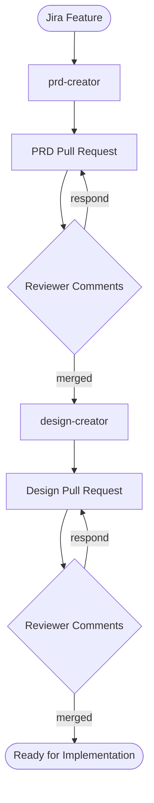

# OSAC AI Skills

Autonomous AI skills for the [OSAC](https://github.com/osac-project) (Open Sovereign AI Cloud) SDLC pipeline. Generates PRDs and design documents from Jira Features, self-reviews against calibrated rubrics, publishes to GitHub for review, and responds to reviewer feedback — all without human interaction.

## Pipeline



## Quick Start

```bash
# Clone
git clone https://github.com/eranco74/ai-skills.git
cd ai-skills

# Generate a PRD
cd skills/prd-creator
python3 scripts/fetch_feature.py OSAC-1270 --output artifacts/prd-tasks/OSAC-1270-source.md
# In Claude Code: "Read prompts/generate-prd.md and context/, generate PRD for OSAC-1270"
python3 scripts/score_prd.py check-structure artifacts/prd-tasks/OSAC-1270.md

# Generate a design (after PRD exists)
cd ../design-creator
python3 scripts/fetch_feature.py OSAC-1270 --output artifacts/design-tasks/OSAC-1270-source.md
cp /path/to/enhancement-proposals/enhancements/OSAC-1270-*/prd.md artifacts/design-tasks/OSAC-1270-prd.md
# In Claude Code: "Read prompts/generate-design.md and context/, generate design for OSAC-1270"
```

## Skills

### Document Creators

| Skill | What it does | Eval Results |
|-------|-------------|-------------|
| [prd-creator](skills/prd-creator/) | Generates PRDs from Jira Features. User stories by persona, In/Out Scope, size-calibrated output. | 10 cases, 4.5/5 vs gold |
| [design-creator](skills/design-creator/) | Generates design documents (EPs) from PRDs. Proto schemas, controller patterns, test plans, UI-aware. | 6 cases, 7.5/8 avg |

### Reviewers

| Skill | Rubric | Pass Threshold |
|-------|--------|---------------|
| [prd-review](skills/prd-review/) | WHAT, WHY, User-Facing Focus, Right-Sized, Testability | 7/10, no zeros |
| [design-review](skills/design-review/) | Architecture, Feasibility, Scope, Testability | 5/8, no zeros |

### Forge Overrides

[Forge-compatible](https://github.com/forge-sdlc/forge) skill overrides in [`forge-skills/osac/`](forge-skills/) — same domain knowledge packaged for Forge's automation backbone.

## Prerequisites

| Tool | Required For | Installation |
|------|-------------|-------------|
| `jira` CLI | Fetching Jira features | [jira-cli](https://github.com/ankitpokhrel/jira-cli) |
| `gh` CLI | Publishing PRs, responding to reviews | [gh](https://cli.github.com/) |
| Python 3.9+ | Scripts (standard library only) | — |
| Claude Code / Cursor | Running the LLM generation and review | — |

## How It Works

Each creator runs a pipeline:

```
FETCH → GENERATE → ASSESS → REVIEW → REVISE → FIXUP → REASSESS (max 2) → REPORT
```

- **Script phases** (Python) handle deterministic work: Jira fetch, structure checks, scoring, provenance, publish
- **Agent phases** (LLM) handle generation, review, and revision
- **Self-review** scores against a calibrated rubric with concrete examples
- **Auto-fix** revises flagged issues (design leakage, missing personas, scope problems)
- **Reassessment** re-scores after revision (max 2 cycles to prevent infinite loops)

### What Makes It OSAC-Specific

- **4 personas**: Cloud Provider Admin, Cloud Infrastructure Admin, Tenant Admin, Tenant User
- **5 services**: BMaaS, CaaS, VMaaS, MaaS, Enclave
- **Cross-cutting dimensions**: Tenant onboarding, networking, storage, installation, UI, E2E testing
- **API conventions**: Standard object shape, gRPC error codes, tenant isolation annotations
- **Size calibration**: Output depth matched to feature complexity (from Forge)
- **Exemplars**: Gold-standard merged PRDs and designs as few-shot references

## Evaluation

Each creator includes a test suite with gold-standard documents from merged [enhancement-proposals](https://github.com/osac-project/enhancement-proposals) PRs.

```bash
# Run all PRD eval cases
cd skills/prd-creator && python3 scripts/run_eval.py --all

# Run all design eval cases  
cd skills/design-creator && python3 scripts/run_eval.py --all

# Run a single case
python3 scripts/run_eval.py --cases OSAC-1270

# Lint all skills
make skillsaw
```

### Deterministic Checks

**PRD checks** (`score_prd.py`): structure, persona coverage, design leakage, duplicate stories, length

**Design checks** (`score_design.py`): structure (15 sections), frontmatter, proto schemas, tenant isolation, placeholders, length. UI-aware — detects UI designs and adjusts expectations.

## Installation

### Into osac-workspace

```bash
git clone https://github.com/eranco74/ai-skills.git osac-ai-skills
```

### Into Forge

```bash
forge skills install --project osac ./ai-skills/forge-skills
```

### Standalone

Clone and use directly — requires `jira` and `gh` CLIs but no osac-workspace bootstrap.

## Relationship to flightctl/ai-workflows

| Repo | Mode | Skills |
|------|------|--------|
| [flightctl/ai-workflows](https://github.com/flightctl/ai-workflows) | Attended (human-in-the-loop) | `/prd:ingest`, `/prd:clarify`, `/prd:draft`, `/design:draft` |
| This repo | Autonomous (unattended) | `prd-creator`, `design-creator`, `prd-review`, `design-review` |

Both install into osac-workspace. Developers choose attended or autonomous based on their needs. The autonomous creators produce output compatible with ai-workflows downstream phases.

## Contributing

```bash
# Lint before submitting
make skillsaw

# Run evals to verify changes don't regress
cd skills/prd-creator && python3 scripts/run_eval.py --all
cd skills/design-creator && python3 scripts/run_eval.py --all
```

PRs are linted automatically by the [Skillsaw GitHub Action](.github/workflows/skillsaw.yml).
